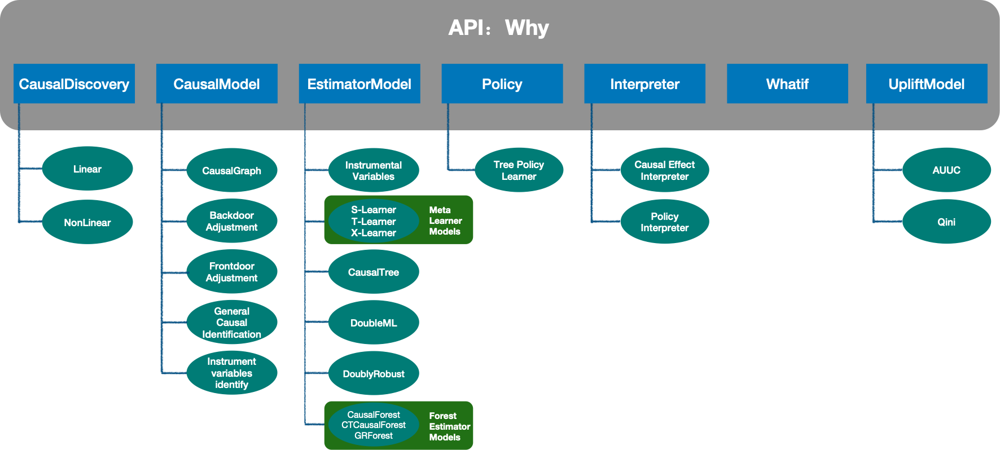
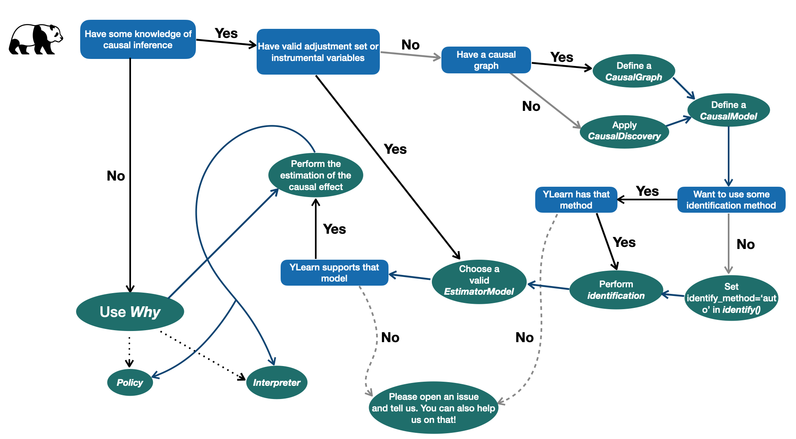
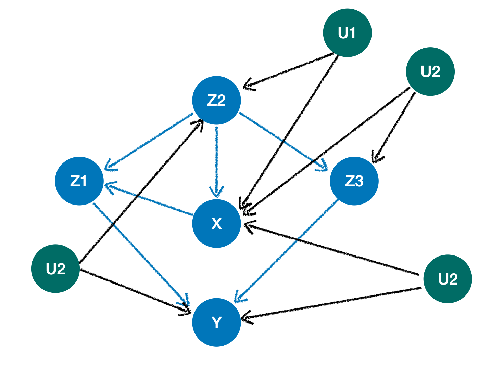

**YLearn**, a pun of "learn why", is a python package for causal inference which supports various aspects of causal inference ranging from causal effect identification, estimation, and causal graph discovery, etc.

**Documentation website**: <https://ylearn.readthedocs.io>

**中文文档地址**：<https://ylearn.readthedocs.io/zh_CN/latest/>

## Installation

### Pip

The simplest way of installing YLearn is using `pip`:

```bash
pip install ylearn
```

## Overview of YLearn

Machine learning has made great achievements in recent years.
The areas in which machine learning succeeds are mainly for prediction,
e.g., the classification of pictures of cats and dogs. However, machine learning is incapable of answering some
questions that naturally arise in many scenarios. One example is for the **counterfactual questions** in policy
evaluations: what would have happened if the policy had changed? Due to the fact that these counterfactuals can
not be observed, machine learning models, the prediction tools, can not be used. These incapabilities of machine
learning partly give rise to applications of causal inference in these days.

Causal inference directly models the outcome of interventions and formalizes the counterfactual reasoning.
With the aid of machine learning, causal inference can draw causal conclusions from observational data in
various manners nowadays, rather than relying on conducting craftly designed experiments.

A typical complete causal inference procedure is composed of three parts. First, it learns causal relationships
using the technique called causal discovery. These relationships are then expressed either in the form of Structural
Causal Models or Directed Acyclic Graphs (DAG). Second, it expresses the causal estimands, which are clarified by the
interested causal questions such as the average treatment effects, in terms of the observed data. This process is
known as identification. Finally, once the causal estimand is identified, causal inference proceeds to focus on
estimating the causal estimand from observational data. Then policy evaluation problems and counterfactual questions
can also be answered.

YLearn, equipped with many techniques developed in recent literatures, is implemented to support the whole causal inference pipeline from causal discovery to causal estimand estimation with the help of machine learning. This is more promising especially when there are abundant observational data.

### Concepts in YLearn



There are 5 main concepts in YLearn corresponding to the causal inference pipeline.

1. *Causal Discovery*. Discovering the causal relationships in the observational data.

2. *Causal Model*. Representing the causal relationships in the form of ``CausalGraph`` and doing other related operations such as identification with ``CausalModel``.

3. *Estimator Model*. Estimating the causal estimand with various techniques.

4. *Policy Model*. Selecting the best policy for each individual.

5. *Interpreters*. Explaining the causal effects and polices.

These components are connected to give a full pipeline of causal inference, which are also encapsulated into a single API `Why`.

### Pipeline in YLearn


*The pipeline of causal inference in YLearn.*

Starting from the training data:

1. One first uses the `CausalDiscovery` to reveal the causal structures in data, which will usually output a `CausalGraph`.
2. The causal graph is then passed into the `CausalModel`, where
the interested causal effects are identified and converted into statistical estimands.
3. An `EstimatorModel` is then trained with the training data
to model relationships between causal effects and other variables, i.e., estimating causal effects in training data.
4. One can then use the trained `EstimatorModel` to predict causal effects in some new test dataset and evaluate the policy assigned to each individual or interpret the estimated causal effects.

It is also helpful to use the following flow chart in many causal inference tasks




## Quick Start

In this part, we first show several simple example usages of YLearn. These examples cover the most common functionalities. Then we present a case stuy with `Why` to unveil the hidden
causal relations in data.

### Example usages

We present several necessary example usages of YLearn in this section, which covers defining a causal graph, identifying the causal effect, and training an estimator model, etc. Please see their specific documentations for more details.

1. Representation of the causal graph

   Given a set of variables, the representation of its causal graph in YLearn requires a python `dict` to denote the causal relations of variables, in which the *keys* of the `dict` are children of all elements in the corresponding values which usually should be a list of names of variables. For an instance, in the simplest case, for a given causal graph `X <- W -> Y`, we first define a python `dict` for the causal relations, which will then be passed to `CausalGraph` as a parameter:

    ```python
        causation = {'X': ['W'], 'W':[], 'Y':['W']}
        cg = CausalGraph(causation=causation)
    ```

   `cg` will be the causal graph encoding the causal relation `X <- W -> Y` in YLearn. If there exist unobserved confounders in the causal graph, then, aside from the observed variables, we should also define a python `list` containing these causal relations. For example, a causal graph with unobserved confounders (green nodes)

   

   is first converted into a graph with latent confounding arcs (black dotted llines with two directions)

   

   To represent such causal graph, we should (1) define a python `dict` to represent the observed parts, and (2) define a `list` to encode the latent confounding arcs where each element in the `list` includes the names of the start node and the end node of a latent confounding arc:

   ```python
        from ylearn.causal_model.graph import CausalGraph
        causation_unob = {
            'X': ['Z2'],
            'Z1': ['X', 'Z2'],
            'Y': ['Z1', 'Z3'],
            'Z3': ['Z2'],
            'Z2': [], 
        }
        arcs = [('X', 'Z2'), ('X', 'Z3'), ('X', 'Y'), ('Z2', 'Y')]

        cg_unob = CausalGraph(causation=causation_unob, latent_confounding_arcs=arcs)

2. Identification of causal effect

   It is crucial to identify the causal effect when we want to estimate it from data. The first step for identifying the causal effect is identifying the causal estimand. This can be easily done in YLearn. For an instance, suppose that we are interested in identifying the causal estimand `P(Y|do(X=x))` in the causal graph `cg` defined above, then we can simply define an instance of `CausalModel` and call the `identify()` method:

    ```python

        cm = CausalModel(causal_graph=cg)
        cm.identify(treatment={'X'}, outcome={'Y'}, identify_method=('backdoor', 'simple'))

    ```

    where we use the *backdoor-adjustment* method here. YLearn also supports front-door adjustment, finding instrumental variables, and, most importantly, the general identification method developed in [1] which is able to identify any causal effect if it is identifiable.

3. Instrumental variables

   Instrumental variable is an important technique in causal inference. The approach of using YLearn to find valid instrumental variables is very straightforward. For example, suppose that we have a causal graph

   ,

   we can follow the common procedure of utilizing `CausalModel` to find the instrumental variables: (1) define the `dict` and `list` of the causal relations; (2) define an instance of `CausalGraph` to build the related causal graph in YLearn; (3) define an instance of `CausalModel` with the instance of `CausalGraph` in last step being the input; (4) call the `get_iv()` method of `CausalModel` to find the instrumental variables

   ```python
        
        causation = {
            'p': [],
            't': ['p', 'l'],
            'l': [],
            'g': ['t', 'l']
        }
        arc = [('t', 'g')]
        cg = CausalGraph(causation=causation, latent_confounding_arcs=arc)
        cm = CausalModel(causal_graph=cg)
        cm.get_iv('t', 'g')
   ```

4. Estimation of causal effect

   The estimation of causal effects in YLearn is also fairly easy. It follows the common approach of deploying a machine learning model since YLearn focuses on the intersection of machine learning and causal inference in this part. Given a dataset, one can apply any `EstimatorModel` in YLearn with a procedure composed of 3 distinct steps:

    * Given data in the form of  `pandas.DataFrame`, find the names of `treatment, outcome, adjustment, covariate`.
    * Call  `fit()` method of  `EstimatorModel` to train the model.
    * Call  `estimate()` method of  `EstimatorModel` to estimate causal effects in test data.

    One can refer to the documentation website for methodologies of many estimator models implemented by YLearn.

5. Using the all-in-one API: Why

    For the purpose of applying YLearn in a unified and eaiser manner, YLearn provides the API `Why`. `Why` is an API which encapsulates almost everything in YLearn, such as identifying causal effects and scoring a trained estimator model. To use `Why`, one should first create an instance of `Why` which needs to be trained by calling its method `fit()`, after which other utilities, such as `causal_effect()`, `score()`, and `whatif()`, can be used. This procedure is illustrated in the following code example:

    ```python

        from sklearn.datasets import fetch_california_housing

        from ylearn import Why

        housing = fetch_california_housing(as_frame=True)
        data = housing.frame
        outcome = housing.target_names[0]
        data[outcome] = housing.target

        why = Why()
        why.fit(data, outcome, treatment=['AveBedrms', 'AveRooms'])

        print(why.causal_effect())
    ```

### Case Study

In the notebook [CaseStudy](https://github.com/DataCanvasIO/YLearn/blob/main/example_usages/case_study_bank.ipynb), we utilize a typical bank customer dataset to demonstrate the usage of the all-in-one API `Why` of YLearn. `Why` covers the full processing pipeline of causal learning, including causal discovery, causal effect identification, causal effect estimation, counterfactual inference, and policy learning. Please refer to [CaseStudy](https://github.com/DataCanvasIO/YLearn/blob/main/example_usages/case_study_bank.ipynb) for more details.

## References

[1] J. Pearl. Causality: models, reasoing, and inference.

[2] S. Shpister and J. Identification of Joint Interventional Distributions in Recursive Semi-Markovian Causal Models. *AAAI 2006*.

[3] B. Neal. Introduction to Causal Inference.

[4] M. Funk, et al. Doubly Robust Estimation of Causal Effects. *Am J Epidemiol. 2011 Apr 1;173(7):761-7.*

[5] V. Chernozhukov, et al. Double Machine Learning for Treatment and Causal Parameters. *arXiv:1608.00060.*

[6] S. Athey and G. Imbens. Recursive Partitioning for Heterogeneous Causal Effects. *arXiv: 1504.01132.*

[7] A. Schuler, et al. A comparison of methods for model selection when estimating individual treatment effects. *arXiv:1804.05146.*

[8] X. Nie, et al. Quasi-Oracle estimation of heterogeneous treatment effects. *arXiv: 1712.04912.*

[9] J. Hartford, et al. Deep IV: A Flexible Approach for Counterfactual Prediction. *ICML 2017.*

[10] W. Newey and J. Powell. Instrumental Variable Estimation of Nonparametric Models. *Econometrica 71, no. 5 (2003): 1565–78.*

[11] S. Kunzel2019, et al. Meta-Learners for Estimating Heterogeneous Treatment Effects using Machine Learning. *arXiv: 1706.03461.*

[12] J. Angrist, et al. Identification of causal effects using instrumental variables. *Journal of the American Statistical Association*.

[13] S. Athey and S. Wager. Policy Learning with Observational Data. *arXiv: 1702.02896.*

[14] P. Spirtes, et al. Causation, Prediction, and Search.

[15] X. Zheng, et al. DAGs with NO TEARS: Continuous Optimization for Structure Learning. *arXiv: 1803.01422.*
