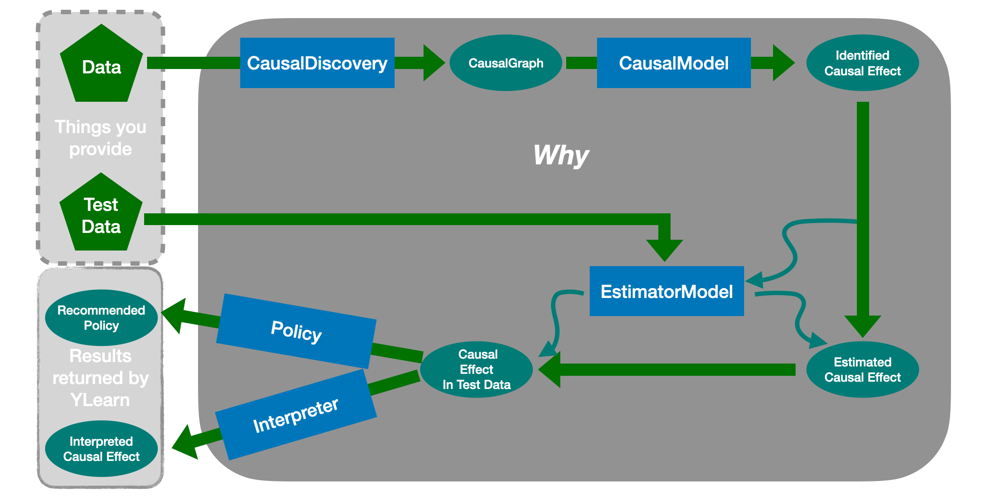

***************************************
Overview of YLearn and Causal Inference
***************************************

Machine learning has made great achievements in recent years. 
The areas in which machine learning succeeds are mainly for prediction, 
e.g., the classification of pictures of cats and dogs. However, machine learning is incapable of answering some 
questions that naturally arise in many scenarios. One example is for the **counterfactual questions** in policy 
evaluations: what would have happened if the policy had changed? Due to the fact that these counterfactuals can 
not be observed, machine learning models, the prediction tools, can not be used. These incapabilities of machine 
learning partly give rise to applications of causal inference in these days.

Causal inference directly models the outcome of interventions and formalizes the counterfactual reasoning.
With the aid of machine learning, causal inference can draw causal conclusions from observational data in 
vairous manners nowdays, rather than relying on conducting craftly designed experiments.

A typical complete causal inference procedure is composed of three parts. First, it learns causal relationships
using the technique called causal discovery. These relationships are then expressed either in the form of Structural 
Causal Models or Directed Acyclic Graphs (DAG). Second, it expresses the causal estimand, which are clarified by the 
interested causal questions such as the average treatment effects, in terms of the observed data. This process is 
known as identification. Finally, once the causal estimand is identified, causal inference proceeds to focus on
estimating the causal estimand from observational data. Then policy evaluation problems and counterfactual questions
can also be answered.

YLearn, equiped with many techniques developed in recent literatures, is implemented to support the whole causal 
inference pipeline from causal discovery to causal estimand estimation with the help of machine learning. This is 
more promising especially when there are abundant observational data. 

Concepts in YLearn and their related problem settings
=====================================================
There are three main components in YLearn corresponding to the causal inference pipeline.

.. figure:: structure_ylearn.png

    *Components in YLearn*

1. *Causal Discovery*. Discovering the causal relationships in the observational data.

2. *Causal Model*. Representing the causal relationships in the form of ``CausalGraph`` and doing other related operations such as identification with ``CausalModel``.

3. *Estimator Model*. Estimating the causal estimands with vairous techniques.

4. *Policy Model*. Selecting the best policy for each individual.

5. *Interpreters*. Explain the causal effects and polices.

These components are conneted to give a full pipeline of causal inference, which are also encapsulated into a single API `Why`.

    *The pipeline of causal inference in YLearn*. Starting from the training data, one first uses the `CausalDiscovery` to reveal
    the causal structures in data, which will usually output a `CausalGraph`. The causal graph is then passed into the `CausalModel`, where
    the interested causal effects are identified and converted into statistical estimands. An `EstimatorModel` is then trained with the training data
    to model relationships between causal effects and other variables, i.e., estimating causal effects in training data. One can then
    use the trained `EstimatorModel` to predict causal effects in some new test dataset and evaluate the policy assigned to each individual or interpret
    the estiamted causal effects.

All APIs are introduced in :ref:`api`.
