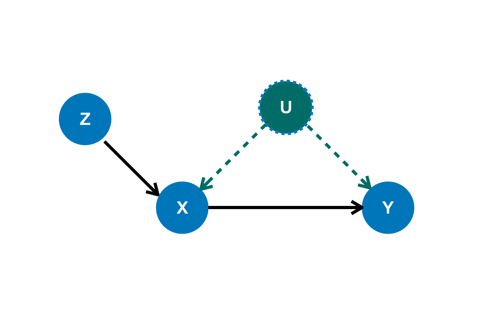
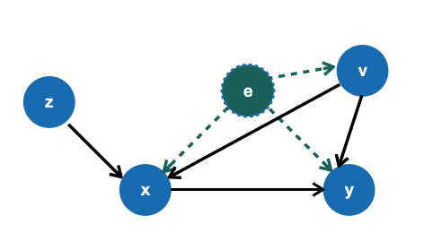

**********************
工具变量
**********************

工具变量（IV）处理这样的情况：在存在未观察到的混淆变量，其同时影响治疗 :math:`X` 和结果 :math:`Y` 时，对因果效应进行估计。一组变量 :math:`Z` 被称为一组 **工具变量** 如果对于
任何在 :math:`Z` 中的 :math:`z` 。
    
    1. :math:`z` 对 :math:`X` 有因果效应。

    2. :math:`z` 对 :math:`Y` 的因果效应完全由 :math:`X` 调节。

    3. 从 :math:`z` 到 :math:`Y` 没有后门路径。

在这样的情况下，我们必须首先找到IV（其可以通过使用 :class:`CausalModel` 完成，参考 :ref:`identification` ）。举个例子，变量 :math:`Z` 在下面的图中
可以作为一个合理的IV，在存在未观察到的混淆变量 :math:`U` 时估计 :math:`X` 对 :math:`Y` 的因果效应。

    Causal graph with IV

YLearn关于IV实现两个不同的方法：deepiv [Hartford]_ ，对IV使用深度学习模型和IV的无参数模型 [Newey2002]_ 。

IV框架和问题设置
====================================
IV框架的目的是预测结果 :math:`y` 的值当治疗 :math:`x` 给定时。除此之外，还存在一些协变量向量 :math:`v` 其同时影响 :math:`y` 和 :math:`x`。
还有一些未观察到的混淆因素 :math:`e` 其潜在影响 :math:`y` ，:math:`x` 和 :math:`v` 。因果问题的核心部分是估计因果量。

.. math::

    \mathbb{E}[y| do(x)]

下面的因果图，其中因果关系的集合由函数的集合决定

.. math::

    y & = f(x, v) + e\\
    x & = h(v, z) + \eta\\
    \mathbb{E}[e] & = 0.

    Causal graph with IV and both observed and unobserved confounders

IV框架通过做两步估计解决这个问题：

    1. 估计 :math:`\hat{H}(z, v)` 其捕获在 :math:`x` 和变量 :math:`(z, v)` 之间的关系。

    2. 用预测的结果 :math:`\hat{H}(z, v)` 取代 :math:`x` 给定 :math:`(v, z)` 。接着估计 :math:`\hat{G}(x, v)` 来构建 :math:`y` 和 :math:`(x, v)` 之间的关系。

最终的因果效应能够被计算。

IV Classes
===========

.. toctree::
    :maxdepth: 2
    
    iv/iv_normal
    iv/deepiv